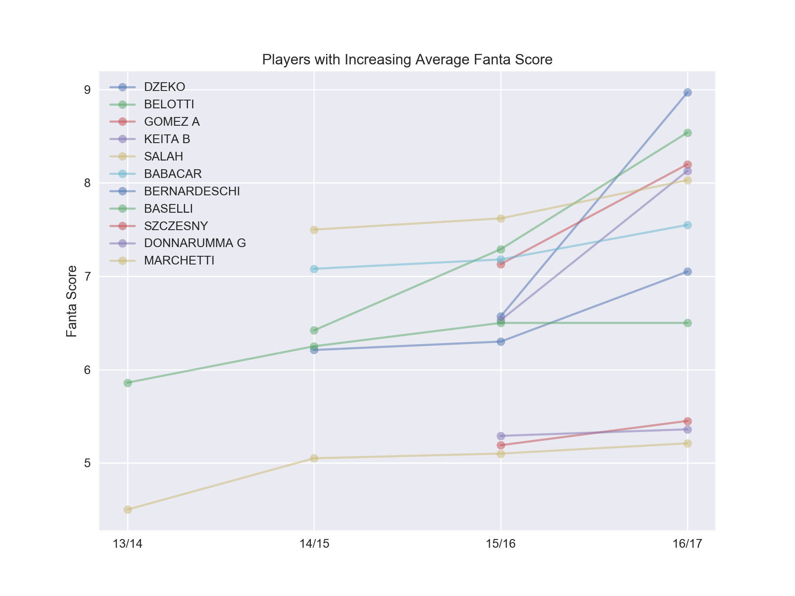
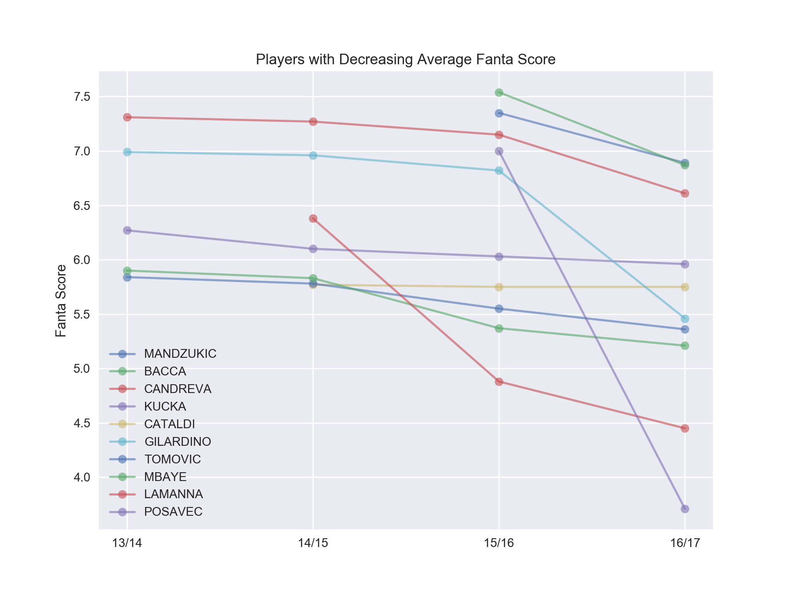
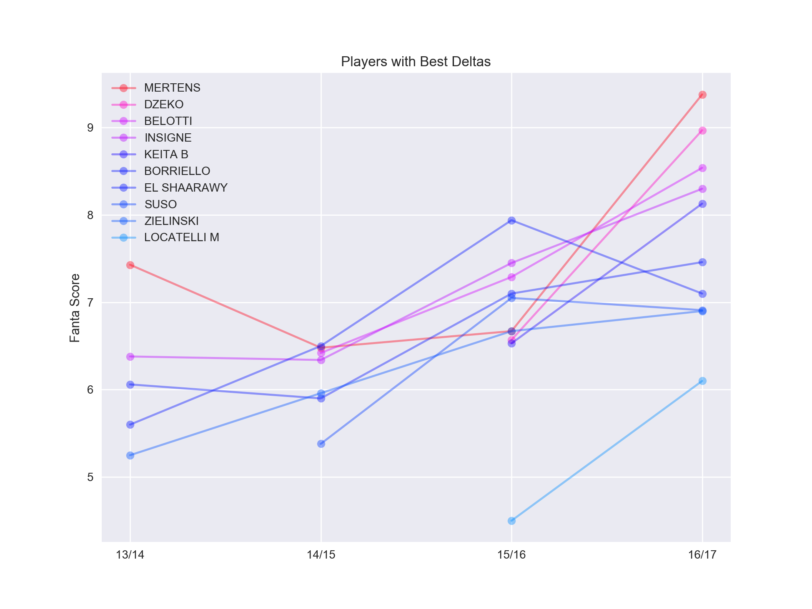
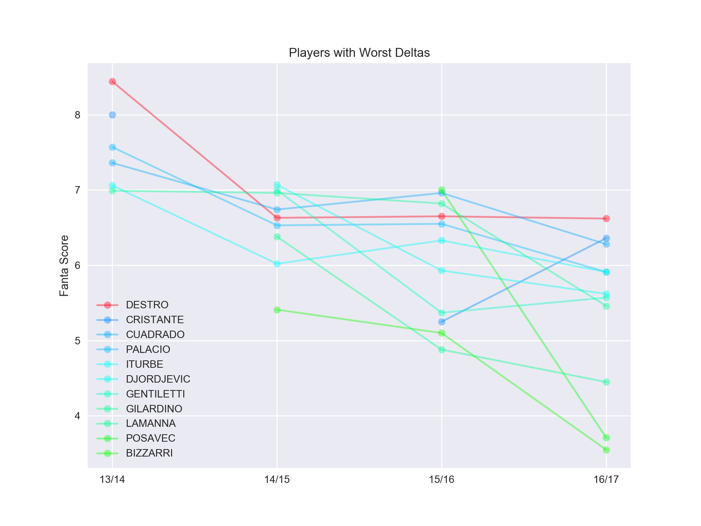
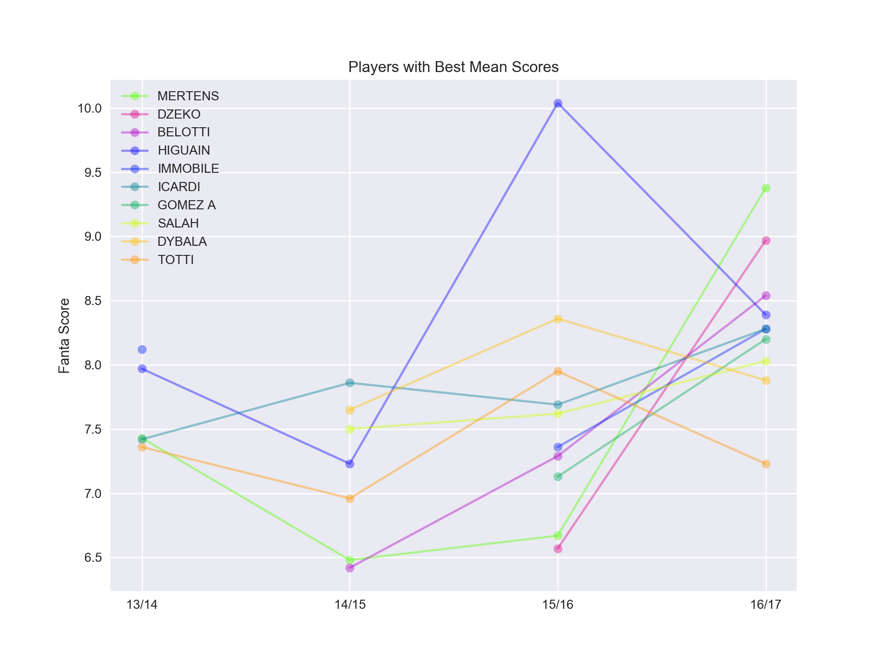
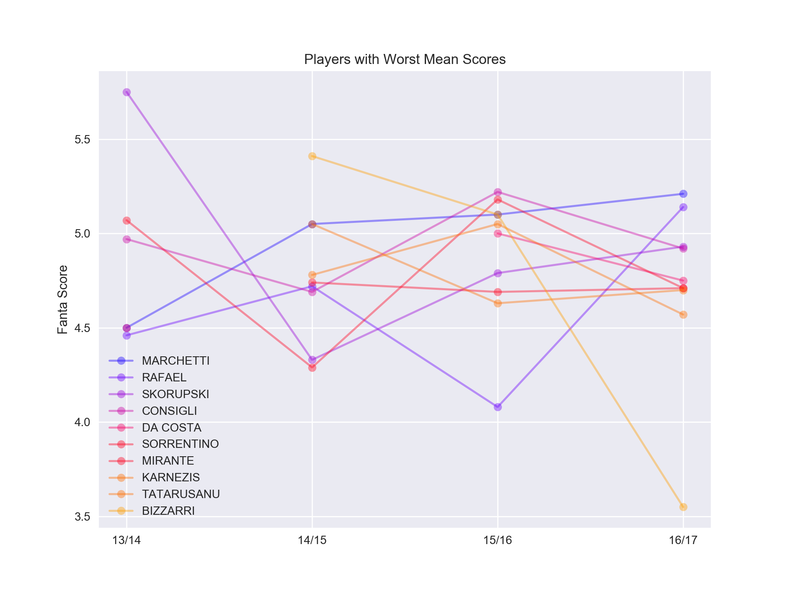
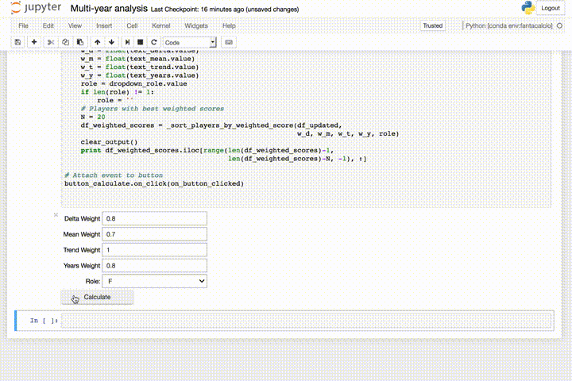
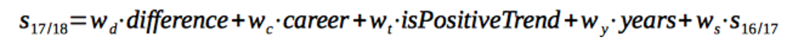

# Fantasy Football Data Analysis
A blog post was created to explain the details of this project. [English version available here](https://medium.com/@davide.totaro/a-simple-method-to-predict-player-performance-using-fantasy-football-data-8b2d3adb3a1a), Italian [here](https://medium.com/@davide.totaro/i-migliori-giocatori-della-stagione-fantacalcio-2017-2018-secondo-i-dati-c2ce55dca29b).

## Overview
The goal of this project is to analyze data related to Serie A Fantasy Football (aka **Fantacalcio**) from past years and use the results to predict the best players for the next football season.  
The code is contained in a Jupyter Notebook file, which can be used to import data, visualize the graphs and get results of the analysis.

## Visualizations
The following are some of the results obtained by analyzing the data.  
  
### Trends  
  
  
  
### Deltas  
  
  
  
### Mean Scores  
  
  
  

## Interactive Calculator
The final part of the code includes an interactive calculator which can be used to predict players who will have the best performance next season.  
  
  
  
The weights are used to calculate an approximate score for next season. The formula is the following:  
